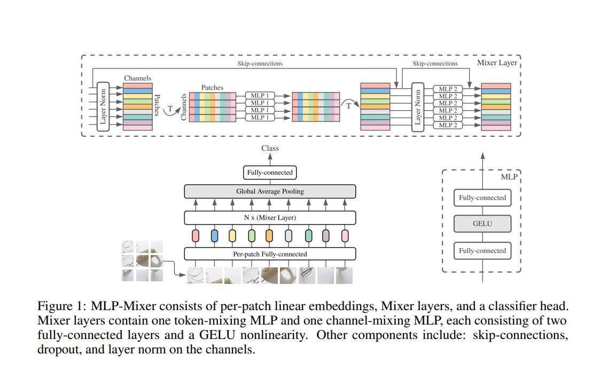

# [PYTORCH] MLP-Mixer: An all-MLP Architecture for Vision

## Introduction

Implementation for paper [MLP-Mixer: An all-MLP Architecture for Vision](https://arxiv.org/pdf/2105.01601.pdf). Give me a star if you like this repo.

Author:

- Github: project01-neural-network

- Email: projet01.neuralnetwork@gmail.com


[Note] You can use your data to train this model.
### I. Set up environment

1. Make sure you have installed pytorch and related libraries.

### II. Set up your dataset.

Create 2 folders `train` and `valid` in the `data` folder (which was created already). Then `Please copy` your images with the corresponding names into these folders.

- `train` folder was used for the training process
- `valid` folder was used for validating training result after each epoch

This library use `torchvision.datasets.ImageFolder` API from `Pytorch` to load images. Make sure you have some understanding of how it works via [its document](https://pytorch.org/vision/0.16/generated/torchvision.datasets.ImageFolder.html).

Structure of these folders.

```
train/
...class_a/
......a_image_1.jpg
......a_image_2.jpg
...class_b/
......b_image_1.jpg
......b_image_2.jpg
...class_c/
......c_image_1.jpg
......c_image_2.jpg
```

```
valid/
...class_a/
......a_image_1.jpg
......a_image_2.jpg
...class_b/
......b_image_1.jpg
......b_image_2.jpg
...class_c/
......c_image_1.jpg
......c_image_2.jpg
```

### III. Train your model by running this command line

```bash
python train.py --epochs ${epochs} --num-classes ${num_classes}
```

You want to train a model in 10 epochs for binary classification problems (with 2 classes)

Example:

```bash
python train.py --epochs 10 --num-classes 2
```

You can train CIFAR10 dataset without put data to folders

```bash
python train.py --dataset CIFAR10 --epochs 10 --num-classes 10 --image-size 32 --patch-size 4 --batch-size 4 --tokens-mlp-dim  1024 --channels-mlp-dim 128 --hidden-dim 256 --num-of-mlp-blocks 2
```

There are some `important` arguments for the script you should consider when running it:

- `dataset`: Get training on CIFAR10 dataset or your dataset
- `train-folder`: The folder of training images
- `valid-folder`: The folder of validation images
- `num-classes`: The number of your problem classes.
- `batch-size`: The batch size of the dataset
- `patch-size`: The patch size of the model (Patch resolution P x P)
- `hidden-dim`: Patch Projection Dimension (Hidden size C)
- `tokens-mlp-dim`: Token-mixing units (MLP dimension Ds).
- `channels-mlp-dim`: Channel-mixing units (MLP dimension Dc).
- `num-of-mlp-blocks`: The number of MLP Blocks (Number of layer)
- `log-path`: Where the model when training writed (loss, acc) and after training saved

After training successfully, your model will be saved to `log-path` defined before

Some import params you should follow:


### IV. Testing model with a new image

We offer a script for testing a model using a new image via a command line:

```bash
python predict.py --test-file-path ${test_file_path}
```

where `test_file_path` is the path of your test image.

Example:

```bash
python predict.py --test-file-path ./data/test/cat.2000.jpg
```

### IV. Contribute

If you meet any issues when using this library, please let me know via the issues submission tab.
